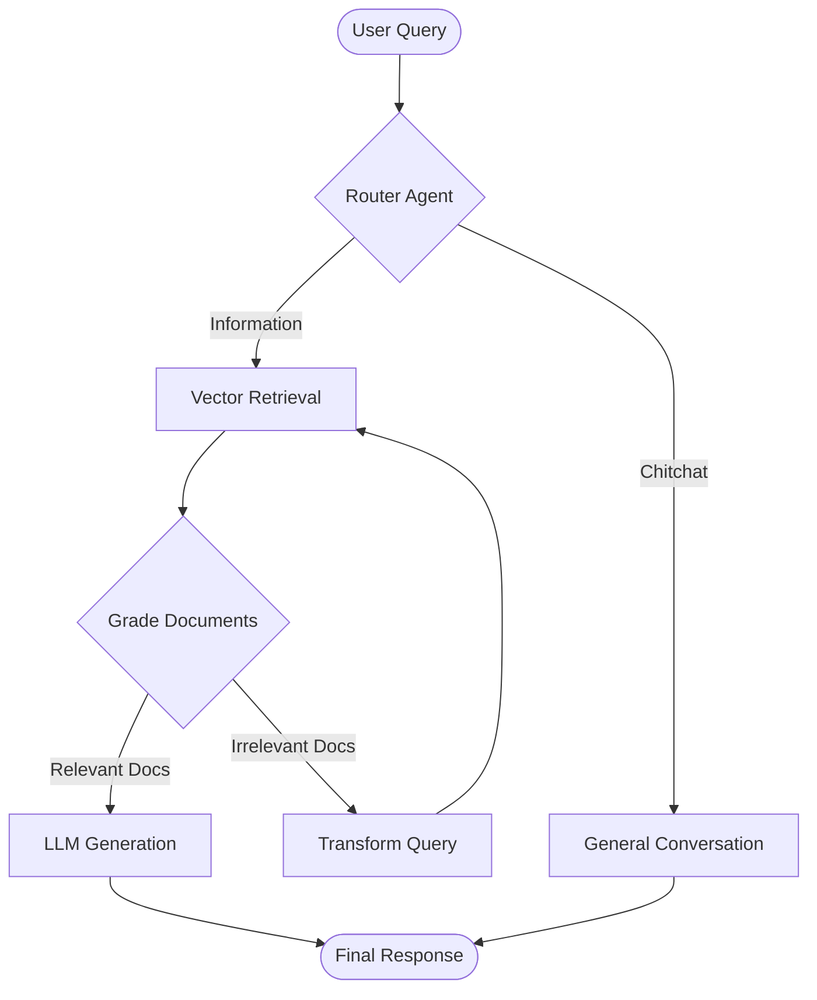

# Agentic RAG: Enterprise Knowledge Assistant

> **A local-first, autonomous Retrieval Augmented Generation (RAG) system capable of complex reasoning, self-correction, and multi-document synthesis.**

---

## 📖 Executive Summary

This project implements an **Agentic RAG** architecture designed to solve the hallucination and retrieval accuracy problems common in standard RAG systems. Unlike a linear "retrieve-then-generate" pipeline, this system uses a **Cognitive Graph (State Machine)** to reason about user queries.

It features a self-correcting workflow that can reject irrelevant documents, rewrite search queries, and dynamically adjust its response mode based on complexity. Built to mimic an enterprise deployment, it includes microservices architecture, vector caching, and re-ranking models for high-precision retrieval.

---

## 🏗️ High-Level Architecture

The core "brain" of the application is a **LangGraph State Machine** (`backend/agents/graph_agent.py`) that orchestrates the flow of data.



### 🧠 Key Agentic Capabilities

* **Routing Agent:** Semantically classifies queries to avoid wasting compute on non-retrieval questions (e.g., "Hello").
* **Relevance Grader:** An evaluator agent analyzes retrieved documents to ensure they actually contain the answer before passing them to the generator.
* **Self-Correction:** If retrieved documents are poor, the agent **rewrites the query** and tries again (Query Transformation).
* **Dynamic Configuration:** Automatically switches between "Concise" and "Detailed" modes based on token depth.

---

## 🚀 Key Features

### 1. Advanced Retrieval Pipeline

* **Hybrid Search:** Uses **FAISS** for fast similarity search combined with a **Cross-Encoder Reranker** (`ms-marco-MiniLM-L-6-v2`) to re-score the top results for maximum accuracy.
* **Embedding Cache:** Implements SQLite-based caching (`EmbedCacheService`) to prevent redundant computation of embeddings, significantly reducing latency for frequent queries.

### 2. Enterprise Engineering Practices

* **Microservices Design:** Decoupled Backend (FastAPI) and Frontend (Chainlit) services communicating via REST APIs.
* **Dockerized Deployment:** Full `docker-compose` setup with volume persistence for vector indices and GPU passthrough support.
* **Asynchronous Processing:** Heavy ingestion tasks are handled via background subprocesses to keep the API responsive.

### 3. Local-First AI

* **Privacy Centric:** Fully compatible with local LLMs via **Ollama** (Mistral, Llama 3). No data leaves the infrastructure.
* **Cost Efficient:** Zero API costs using quantized local models.

---

## 🛠️ Tech Stack

| Component | Technology | Description |
| --- | --- | --- |
| **Orchestration** | **LangGraph** & **LangChain** | State-based agent workflows and chains. |
| **Backend API** | **FastAPI** | High-performance Async Python API. |
| **Vector DB** | **FAISS (CPU)** | Efficient dense vector similarity search. |
| **LLM Server** | **Ollama** | Hosting local models (Mistral, Nomic Embed). |
| **Frontend** | **Chainlit** | React-based chat interface for Python. |
| **Containerization** | **Docker Compose** | Multi-container orchestration. |
| **Reranking** | **Sentence-Transformers** | Cross-encoder for result refinement. |

---

## 📂 Project Structure

A modular "Clean Architecture" approach ensures maintainability.

```bash
├── backend/
│   ├── agents/          # LangGraph definitions (The "Brain")
│   ├── core/            # Config, Logging, Exceptions
│   ├── services/        # Business Logic (Memory, Retrieval, Cache)
│   ├── tools/           # Low-level utilities (Ollama client, FAISS wrapper)
│   ├── models/          # Pydantic Schemas (Request/Response)
│   └── main.py          # FastAPI Entrypoint
├── frontend/
│   └── chainlit_app.py  # UI Logic
├── data/                # Ingestion drop-zone for PDFs/Text
├── docker-compose.yml   # Infrastructure orchestration
└── requirements.txt     # Python dependencies

```

---

## ⚡ Getting Started

### Prerequisites

* [Docker Desktop](https://www.google.com/search?q=https://www.docker.com/) installed.
* [Ollama](https://www.google.com/search?q=https://ollama.ai/) running locally (or configured in `.env`).

### 1. Clone & Configure

```bash
git clone https://github.com/yourusername/agentic-rag.git
cd agentic-rag
cp .env.example .env

```

### 2. Pull Local Models

Ensure your Ollama instance has the required models:

```bash
ollama pull mistral
ollama pull nomic-embed-text

```

### 3. Launch via Docker

Spin up the entire stack with one command:

```bash
docker-compose up --build

```

* **Backend API:** `http://localhost:8000/docs`
* **Frontend UI:** `http://localhost:8001`

---

## 📸 Usage Guide

### Ingesting Knowledge

To make the agent "smart," simply drop PDF or Text files into the `data` directory. The system automatically:

1. Detects the new file.
2. Chunks text (512 tokens with overlap).
3. Embeds content using `nomic-embed-text`.
4. Updates the FAISS index.

### Querying

Open the Chainlit UI at `http://localhost:8001`.

* **Standard Mode:** "What is the summary of the uploaded report?"
* **Deep Research:** Click "Long Answer" to trigger the detailed reasoning path.
* **Creative Mode:** Click "Creative Answer" to adjust the temperature dynamically.

---

## 🔮 Future Roadmap

* [ ] **Multi-Modal Support:** Add vision capabilities for analyzing charts in PDFs.
* [ ] **Graph Database:** Integrate Neo4j to support Knowledge Graph extraction alongside Vector Search.
* [ ] **Evaluation Framework:** Integrate RAGAS scores to programmatically measure retrieval quality.

---

## 👤 Author

**Shreyash Gaur**
*AI Engineer | Python Developer | RAG Specialist*

Passionate about building scalable AI systems that solve real-world problems.