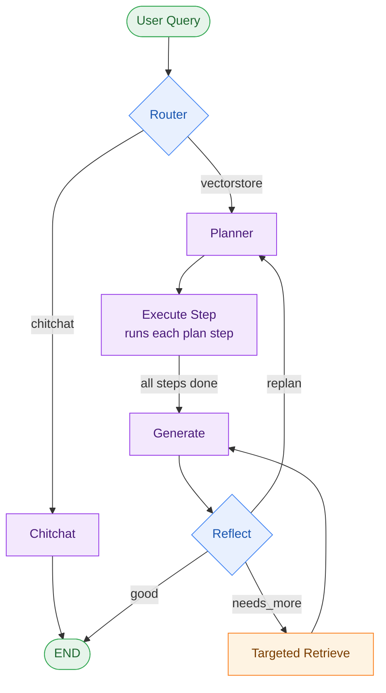

# Agentic RAG — Local Knowledge Assistant

> A fully local, autonomous Retrieval-Augmented Generation system with multi-step planning, self-correction, and hybrid retrieval. No cloud APIs. No data leaves the machine.

---

## Overview

Standard RAG pipelines are linear: retrieve documents, generate an answer. They have no mechanism to detect when retrieval failed, no way to ask a better question, and no ability to reason across multiple sub-queries at once.

This system replaces that linear pipeline with a LangGraph state machine that plans before it retrieves, critiques its own answers, and retries with refined queries when the first attempt falls short. It is designed to handle the class of questions that single-pass RAG gets wrong — ambiguous queries, multi-part questions, and questions where the first retrieved documents are only partially relevant.

---

## Architecture

The agent follows a planner → execute → reflect loop. The graph is compiled once at startup and reused across all requests.


```mermaid
graph TD
    classDef terminal fill:#e6f4ea,stroke:#34a853,color:#1e6830
    classDef decision fill:#e8f0fe,stroke:#4285f4,color:#1a56b0
    classDef agent    fill:#f3e8fd,stroke:#9334e6,color:#4a1a7a
    classDef retrieve fill:#fef3e2,stroke:#fa7b17,color:#7a3d00

    A([User Query]):::terminal      --> B{Router}:::decision
    B -- chitchat                   --> C[Chitchat]:::agent
    B -- vectorstore                --> D[Planner]:::agent
    C                               --> Z([END]):::terminal
    D                               --> E[Execute Step\nruns each plan step]:::agent
    E -- all steps done             --> F[Generate]:::agent
    F                               --> G{Reflect}:::decision
    G -- good                       --> Z
    G -- needs_more                 --> H[Targeted Retrieve]:::retrieve
    G -- replan                     --> D
    H                               --> F
```

### Agent nodes

The **Router** classifies the incoming query as either a chitchat message or a retrieval question. Chitchat is handled directly without touching the vector store, which avoids wasting a full retrieval-generation cycle on greetings or off-topic messages.

The **Planner** decomposes the user question into a sequence of 1–4 tool steps at runtime. Each step has a type (`retrieve`, `calculate`, or `summarise`) and a distinct sub-query. This is the key difference from single-pass RAG — a question like "compare X and Y" is split into two independent retrieve steps with separate sub-queries, rather than being sent as one ambiguous search. If the planner's JSON output cannot be parsed, it falls back to a single retrieve step automatically.

**Execute Step** runs one plan step per iteration and loops until all steps are complete. Each retrieve step embeds its own sub-query independently, so the resulting document sets are diverse rather than redundant.

**Generate** assembles context from all retrieved documents and calls the writer LLM with a mode-appropriate system prompt. The calculator tool is bound at this node and invoked inline if the LLM determines arithmetic is needed.

**Reflect** critiques the generated answer against the retrieved context and returns one of three verdicts: `good` (proceed to END), `needs_more` (trigger a targeted retrieve with a refined query), or `replan` (restart the planner with a reformulated question). The reflection loop is capped at two rounds to prevent runaway retries.

**Targeted Retrieve** runs a focused retrieval pass using the refined query produced by the reflect node, then feeds the new documents back into Generate.

---

## Retrieval Pipeline

Every retrieval call goes through the following sequence, regardless of which node triggered it.

**HyDE (Hypothetical Document Embeddings)** — the user query is passed to the LLM, which generates a short hypothetical answer. That synthetic document is embedded instead of the raw query. The implementation detail that matters: the hypothetical document is embedded *alone*, not concatenated with the original query. Concatenation was the original bug in this codebase — it anchored the embedding to the query rather than the synthetic answer space, which defeats the entire purpose of HyDE.

**FAISS vector search** — the HyDE embedding is searched against the FAISS index. In `detailed` mode, `top_k` is doubled at this stage to give the reranker a larger candidate pool to work with.

**CrossEncoder reranking** — all candidates are rescored by `BAAI/bge-reranker-v2-m3`. The top document score is printed on every query, making retrieval quality directly observable in the logs without any additional tooling.

**Embedding cache** — text-to-vector lookups are cached in SQLite. Identical texts are never re-embedded across requests or restarts, which meaningfully reduces latency on repeated or similar queries.

---

## Semantic Cache

Before the agent runs, every query is checked against a FAISS-backed semantic cache. If a sufficiently similar query has been answered before (cosine similarity ≥ 0.85 using `BAAI/bge-large-en-v1.5`), the cached answer is returned immediately without touching the LLM.

The cache bootstraps itself from the SQLite memory store on startup, so it survives process restarts and accumulates value over time without any manual intervention.

The cache is bypassed when any of the following conditions are true — `mode=detailed`, `temperature > 0.1`, `max_tokens` exceeds the default, or `bypass_cache=True`. This matters because without these conditions, action buttons that request different answer styles silently return the same cached concise answer regardless of the parameters sent. This was a real bug caused by `bypass_cache` being silently dropped by Pydantic before it reached the backend — fixed by adding it as an explicit field in `QueryRequest`.

---

## Response Modes

Mode is an explicit request field — `concise` or `detailed` — not something inferred from token count. In `concise` mode, `top_k` documents are retrieved and the LLM is instructed to answer briefly. In `detailed` mode, `top_k` is doubled at the retrieval stage, `max_tokens` is doubled at generation, and the system prompt instructs the LLM to cover all aspects of the question. The Chainlit frontend sends `mode=detailed` and `bypass_cache=True` on long answer and creative answer button clicks.

---

## Engineering Notes

The LangGraph graph is compiled once in `GraphRAGAgent.__init__` and stored as `self._app`. Earlier versions called `build_graph()` inside `query()`, rebuilding the entire state machine on every request — a silent performance bug with no error output.

The planner, grader, and reflect nodes all parse LLM JSON output. If the model wraps its response in markdown fences (` ```json ``` `), `json.loads()` throws and falls back to a default value, breaking the reflection loop invisibly. The `_invoke_json` helper strips fences before parsing to prevent this.

Service initialisation and teardown use the FastAPI `lifespan` async context manager, not the deprecated `on_event` hooks. CORS is configured with `allow_credentials=False` and `allow_origins=["*"]` — the combination of wildcard origins with `allow_credentials=True` is rejected by browsers.

---

## Tech Stack

| Component | Technology |
|---|---|
| Agent orchestration | LangGraph |
| Backend API | FastAPI |
| Vector store | FAISS |
| Metadata store | SQLite |
| LLM + embeddings | Ollama — qwen2.5:7b, mxbai-embed-large |
| Reranker | BAAI/bge-reranker-v2-m3 (CrossEncoder) |
| Semantic cache encoder | BAAI/bge-large-en-v1.5 |
| Frontend | Chainlit |

---

## Project Structure

```
backend/
├── agents/
│   └── graph_agent.py          # LangGraph state machine
├── core/
│   ├── config.py               # Pydantic settings from .env
│   ├── logger.py
│   └── exceptions.py
├── services/
│   ├── retrieve_service.py     # FAISS + reranker + embed cache
│   ├── memory_service.py       # SQLite-backed conversation memory
│   ├── semantic_cache_service.py
│   └── embed_cache_service.py
├── tools/
│   ├── embedder.py             # Ollama embedding client
│   ├── reranker.py             # CrossEncoder wrapper
│   ├── query_expander.py       # HyDE document generation
│   └── calculator.py           # LangChain tool for arithmetic
├── models/
│   ├── request_models.py       # QueryRequest — mode, bypass_cache fields
│   └── response_models.py
└── main.py                     # FastAPI app, lifespan, /query endpoint

frontend/
└── chainlit_app.py             # Chat UI, action buttons, file upload
```

---

## Getting Started

Ollama must be running locally with the required models:

```bash
ollama pull qwen2.5:7b
ollama pull mxbai-embed-large
```

```bash
cp .env.example .env
```
The key settings to verify are `OLLAMA_MODEL`, `EMBEDDING_MODEL`, `RERANKER_MODEL`, `TOP_K_RETRIEVAL`, and `SEMANTIC_CACHE_THRESHOLD`.

```bash
# Backend
uvicorn backend.main:APP --host 0.0.0.0 --port 8000

# Frontend (separate terminal)
chainlit run frontend/chainlit_app.py -w --port 8001
```

API docs are available at `http://localhost:8000/docs`. To ingest documents, drop PDF or TXT files into the `knowledge/` directory — the file watcher detects new files, chunks them at 512 tokens with 100 token overlap, embeds using mxbai-embed-large, and updates the FAISS index automatically.

---

## Author

**Shreyash Gaur** — AI Engineer
